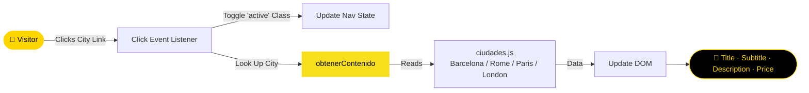

<div align="center">


[](https://git.io/typing-svg)

<br/>

<p align="center">
  <a href="https://github.com/NietoDeveloper">
    
  </a>
  <a href="https://committers.top/colombia#NietoDeveloper">
    
  </a>
  <a href="https://developer.mozilla.org/en-US/docs/Web/JavaScript">
    
  </a>
  <a href="https://pages.github.com/">
    
  </a>
  <a href="https://opensource.org/licenses/MIT">
    
  </a>
</p>

<p align="center">
  <a href="https://nietodeveloper.github.io/CityInfoTravel/">
    
  </a>
  <a href="https://github.com/NietoDeveloper/CityInfoTravel">
    
  </a>
</p>

</div>

---

## 📋 Overview

**City Info Travel** is a travel sales application built with vanilla JavaScript. This tutorial-style project walks through building an app that displays information about different tourist cities and their associated prices. No frameworks or dependencies required.

---

## 🗂️ Project Structure

```text
CityInfoTravel/
└── assets/
    ├── css/          # Stylesheets
    ├── img/            # City images
    └── js/               # JavaScript logic (app.js, ciudades.js)
```

---

## 🔄 City Selection Flow



---

## 🛠️ Technologies Used

<div align="center">

| Layer | Technologies |
|:------|:-------------|
| 🎨 **Frontend** | HTML, CSS, JavaScript |
| ☁️ **Hosting** | GitHub Pages |

</div>

---

## ✨ How the JavaScript Works

The provided JavaScript code updates the information displayed on the page when a city link is clicked.

### City Data Import

The `barcelona`, `roma`, `paris`, and `londres` variables are imported from the `ciudades.js` file, which contains the information for each city. This file must be available alongside the main JavaScript code.

### DOM Element Retrieval

The code uses `document.getElementById` to retrieve the DOM elements needed to update the page content:

- **`enlaces`:** A collection of all anchor (`<a>`) elements on the page.
- **`tituloElemento`:** The title element (`<h1>`) where the selected city's title is displayed.
- **`subTituloElemento`:** The subtitle element (`<h2>`) where the selected city's subtitle is displayed.
- **`parrafoElemento`:** The paragraph element (`<p>`) where the selected city's description is displayed.
- **`precioElemento`:** The element where the selected city's price is displayed.

### Click Event Handling

A `click` event is attached to each link via a `forEach` loop. When a link is clicked, the callback function:

- Removes the `active` class from all links (via another `forEach` loop).
- Adds the `active` class to the current link (`this`).
- Retrieves the corresponding city content using the `obtenerContenido` function and the current link's text.
- Updates the DOM elements with the selected city's information.

### City Content Lookup Function

The `obtenerContenido` function takes the link's text as a parameter and returns the corresponding city content from `ciudades.js`, using a `contenido` object to map link text to city data.

### Customizing Content

City content can be customized by editing `ciudades.js`. Each city is represented by an object with properties such as `titulo`, `subtitulo`, `parrafo`, and `precio`.

---

## 🚀 Getting Started

### Prerequisites

- Basic HTML knowledge.
- A development environment to write and run JavaScript.

### Setup

**Step 1 — Clone the repository**

```bash
git clone https://github.com/NietoDeveloper/CityInfoTravel
```

**Step 2 — Open `index.html`** in a web browser.

---

## 👨‍💻 Author

**Manuel Nieto (NietoDeveloper)**

---

## 📄 License

This project is licensed under the **MIT License**.

<div align="center">

<br/>


</div>


---
iudades.js)
```

---

## 🔄 City Selection Flow


---

## 🛠️ Technologies Used

<div align="center">

| Layer | Technologies |
|:------|:-------------|
| 🎨 **Frontend** | HTML, CSS, JavaScript |
| ☁️ **Hosting** | GitHub Pages |

</div>

---

## ✨ How the JavaScript Works

The provided JavaScript code updates the information displayed on the page when a city link is clicked.

### City Data Import

The `barcelona`, `roma`, `paris`, and `londres` variables are imported from the `ciudades.js` file, which contains the information for each city. This file must be available alongside the main JavaScript code.

### DOM Element Retrieval

The code uses `document.getElementById` to retrieve the DOM elements needed to update the page content:

- **`enlaces`:** A collection of all anchor (`<a>`) elements on the page.
- **`tituloElemento`:** The title element (`<h1>`) where the selected city's title is displayed.
- **`subTituloElemento`:** The subtitle element (`<h2>`) where the selected city's subtitle is displayed.
- **`parrafoElemento`:** The paragraph element (`<p>`) where the selected city's description is displayed.
- **`precioElemento`:** The element where the selected city's price is displayed.

### Click Event Handling

A `click` event is attached to each link via a `forEach` loop. When a link is clicked, the callback function:

- Removes the `active` class from all links (via another `forEach` loop).
- Adds the `active` class to the current link (`this`).
- Retrieves the corresponding city content using the `obtenerContenido` function and the current link's text.
- Updates the DOM elements with the selected city's information.

### City Content Lookup Function

The `obtenerContenido` function takes the link's text as a parameter and returns the corresponding city content from `ciudades.js`, using a `contenido` object to map link text to city data.

### Customizing Content

City content can be customized by editing `ciudades.js`. Each city is represented by an object with properties such as `titulo`, 